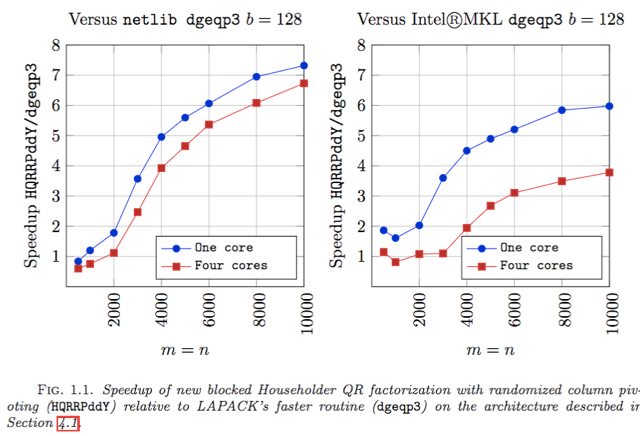

# HQRRP

## Authors

* Per-Gunnar Martinsson,
  Dept. of Applied Mathematics,
  University of Colorado at Boulder,
  526 UCB, Boulder, CO 80309-0526, USA.

* Gregorio Quintana-Orti,
  Depto. de Ingenieria y Ciencia de Computadores,
  Universitat Jaume I,
  12.071 Castellon, Spain.

* Nathan Heavner,
  Dept. of Applied Mathematics,
  University of Colorado at Boulder,
  526 UCB, Boulder, CO 80309-0526, USA.

* Robert van de Geijn,
  Dept. of Computer Science and Institute for Computational Engineering and
  Sciences,
  The University of Texas at Austin,
  Austin, TX, USA.

## Correspondence

Please send correspondence about the code to 
Gregorio Quintana-Ortí: <gquintan@icc.uji.es>

Correspondence about the paper should be sent to
Per-Gunnar J. Martinsson: <Per-gunnar.Martinsson@colorado.edu>

## License

New 3-clause BSD.
See file License.txt for more details.

## Disclaimer

This code is distributed in the hope that it will be useful, but
WITHOUT ANY WARRANTY EXPRESSED OR IMPLIED. 

## Description

Householder transformation based QR factorization with column pivoting is an 
important algorithm for, for example, determining an approximate basis for 
the column space of a matrix. It is, unfortunately, notoriously difficult to 
implement for high performance.

Recently, techniques that use randomized sampling have been developed that
do achieve high performance by casting most computation in terms of
matrix-matrix multiplication.

For example, we describe such an algorithm in our recent paper:

  * P.-G. Martinsson, G. Quintana-Orti, N. Heavner, R. van de Geijn.
    "Householder QR Factorization: Adding Randomization for Column Pivoting.
    FLAME Working Note #78" 
    http://arxiv.org/abs/1512.02671

This directory contains an implementation that we call Householder QR
factorization with Randomization for Pivoting (HQRRP), based on the insights 
in that paper.

The new code outperforms LAPACK's core routine DGEQP3 both in unicore and 
multicore architectures for medium and large matrix sizes, often by large 
factor. The new implementation comes with an interface that is plug 
compatible with DGEQP3. 

The new code can be downloaded from https://github.com/flame/hqrrp/.

The algorithm was originally implemented using the FLAME/C API with 
a variation of the compact WY transform we call the UT transform. 
In addition, 
we also provide an implementation that instead uses the original compact 
WY transform so that many routines from LAPACK can be employed in a 
seamless fashion.  

This implementation as well as the original implementation based on the UT
transform will eventually be included in the libflame library: 
https://github.com/flame/libflame/

We will appreciate feedback from the community on the use of this code.

## Performance benefit



## Citing this work

We ask those who benefit from this work 
to cite the following article:

```
@article{doi:10.1137/16M1081270,
author  = {Martinsson, P. and Quintana Ort\'{\i}, G.
           and Heavner, N. and van de Geijn, R.},
title   = {Householder QR Factorization  
           With Randomization for Column Pivoting (HQRRP)},
journal = {SIAM Journal on Scientific Computing},
volume  = {39},
number  = {2},
pages   = {C96-C115},
year    = {2017},
doi     = {10.1137/16M1081270},
URL     = {https://doi.org/10.1137/16M1081270},
eprint  = {https://doi.org/10.1137/16M1081270}
}
```

<!---
@ARTICLE{martinsson2015blocked,
title   = {Blocked rank-revealing QR factorizations: How randomized 
           sampling can be used to avoid single-vector pivoting},
author  = {Martinsson, Per-Gunnar},
journal = {arXiv preprint arXiv:1505.08115},
year    = {2015},
month   = {may}
}

@ARTICLE{2015arXiv151202671M,
author        = {{Martinsson}, P.-G. and {Quintana-Ort\’{\i}}, G. 
                 and {Heavner}, N. and {van de Geijn}, R.},
title         = "{Householder {QR} Factorization: Adding Randomization for 
                 Column Pivoting. {FLAME} {W}orking {N}ote \#78}",
journal       = {ArXiv e-prints},
archivePrefix = "arXiv",
eprint        = {1512.02671},
primaryClass  = "math.NA",
keywords      = {Mathematics - Numerical Analysis, Computer Science - 
                 Numerical Analysis},
year          = 2015,
month         = dec,
adsurl        = {http://adsabs.harvard.edu/abs/2015arXiv151202671M},
adsnote       = {Provided by the SAO/NASA Astrophysics Data System}
}
-->

## Details

We offer two variants of the code:

* LAPACK-compatible pure C code: 
  It uses compact WY transformations.
  The sources are stored in the `lapack_compatible_sources` directory.

* LAPACK-like libflame code: 
  It uses compact UT transformations.
  This code resembles the algorithm in the paper.
  The sources are stored in the `libflame_sources` directory.

### Details of LAPACK-compatible pure C code: 

The new code contains the following two main routines:

```
void dgeqp4( int * m, int * n, double * A, int * lda, int * jpvt, double * tau,
         double * work, int * lwork, int * info );
// 
// This routine is plug compatible with LAPACK's routine dgeqp3.
// It computes the new HQRRP while keeping the same header as LAPACK's dgeqp3.
// It uses dgeqpf or dgeqp3 for small matrices. The thresholds are defined in
// constants THRESHOLD_FOR_DGEQPF and THRESHOLD_FOR_DGEQP3.
// This routine calls the next one with block size 64 and oversampling 10.
//

int NoFLA_HQRRP_WY_blk_var4( int m_A, int n_A, double * buff_A, int ldim_A,
        int * buff_jpvt, double * buff_tau,
        int nb_alg, int pp, int panel_pivoting );
// 
// This routine is not plug compatible with LAPACK's routine dgeqp3.
// It computes the new HQRRP and allows the user to fine tune more arguments,
// such as the block size, oversampling, etc.
//
```

These two routines are stored in the `NoFLA_HQRRP_WY_blk_var4.c` file.
The `simple_test.c` file in this directory
contains a main program to test routine `dgeqp4`.

### Details of LAPACK-like libflame code: 

The new code contains the following main routine:

```
int FLA_HQRRP_UT_blk_var2( FLA_Obj A, FLA_Obj p, FLA_Obj s, 
        int nb_alg, int pp, int panel_pivoting );
// 
// This routine is not plug compatible with LAPACK's routine dgeqp3.
// It computes the new HQRRP and allows the user to fine tune more arguments,
// such as the block size, oversampling, etc.
//
```

This routine is stored in the `FLA_HQRRP_UT_blk_var2.c` file.
The `simple_test.c` file in this directory contains a main program to test it.

